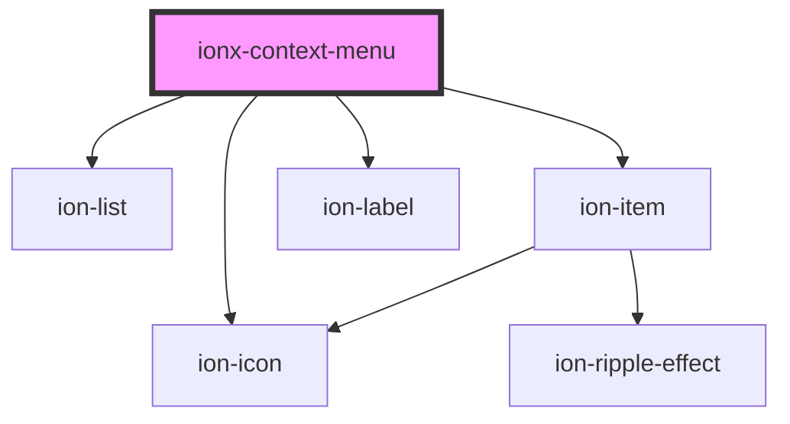

# ionx-context-menu

<!-- Auto Generated Below -->

## Properties

| Property             | Attribute | Description | Type                | Default     |
| -------------------- | --------- | ----------- | ------------------- | ----------- |
| `items` _(required)_ | --        |             | `ContextMenuItem[]` | `undefined` |

## Dependencies

### Depends on

- ion-list
- ion-item
- ion-icon
- ion-label

### Graph

----------------------------------------------

*Built with [StencilJS](https://stenciljs.com/)*
