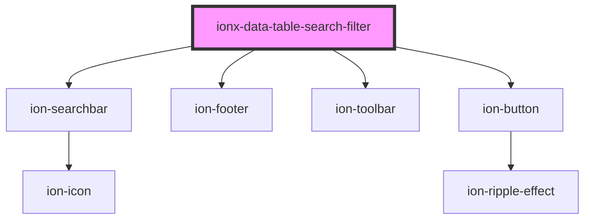

# ionx-data-table-search-filter

<!-- Auto Generated Below -->

## Properties

| Property | Attribute | Description | Type     | Default     |
| -------- | --------- | ----------- | -------- | ----------- |
| `value`  | `value`   |             | `string` | `undefined` |

## Dependencies

### Depends on

- ion-searchbar
- ion-footer
- ion-toolbar
- ion-button

### Graph

----------------------------------------------

*Built with [StencilJS](https://stenciljs.com/)*
