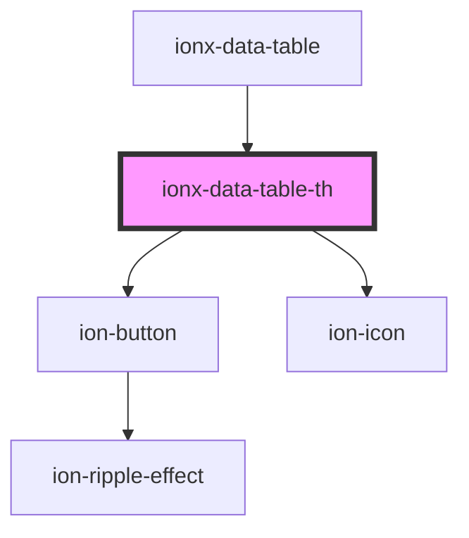

# ionx-data-table-th

<!-- Auto Generated Below -->

## Properties

| Property        | Attribute        | Description                                        | Type                      | Default     |
| --------------- | ---------------- | -------------------------------------------------- | ------------------------- | ----------- |
| `filterApply`   | --               |                                                    | `(filter: Filter) => any` | `undefined` |
| `filterCurrent` | --               | Returns currently applied filter for given column. | `() => Filter`            | `undefined` |
| `filterData`    | --               |                                                    | `() => any[]`             | `undefined` |
| `filterEnabled` | `filter-enabled` |                                                    | `boolean`                 | `undefined` |
| `filterType`    | `filter-type`    |                                                    | `"search" \| "select"`    | `undefined` |

## Dependencies

### Used by

 - [ionx-data-table](.)

### Depends on

- ion-button
- ion-icon

### Graph

----------------------------------------------

*Built with [StencilJS](https://stenciljs.com/)*
