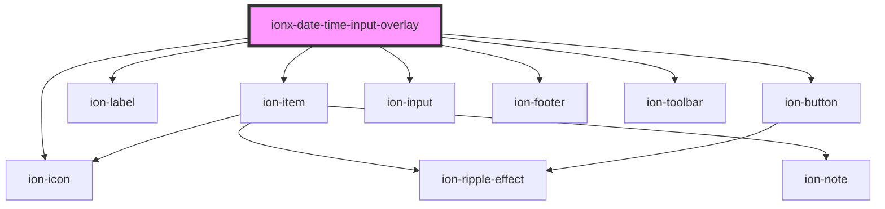

# ionx-date-time-overlay

<!-- Auto Generated Below -->

## Properties

| Property           | Attribute            | Description | Type                                                                                                                                                                     | Default     |
| ------------------ | -------------------- | ----------- | ------------------------------------------------------------------------------------------------------------------------------------------------------------------------ | ----------- |
| `timeZoneDisabled` | `time-zone-disabled` |             | `boolean`                                                                                                                                                                | `undefined` |
| `timeZoneRequired` | `time-zone-required` |             | `boolean`                                                                                                                                                                | `undefined` |
| `type`             | `type`               |             | `"date" \| "date-time" \| "local-date-time" \| ["date"] \| ["date-time", "local-date-time"] \| ["date-time"] \| ["local-date-time", "date-time"] \| ["local-date-time"]` | `undefined` |
| `value`            | --                   |             | `LocalDate \| NoTimeDate \| TimeZoneDate`                                                                                                                                | `undefined` |

## Dependencies

### Depends on

- ion-item
- ion-label
- ion-button
- ion-icon
- ion-input
- ion-footer
- ion-toolbar

### Graph

----------------------------------------------

*Built with [StencilJS](https://stenciljs.com/)*
