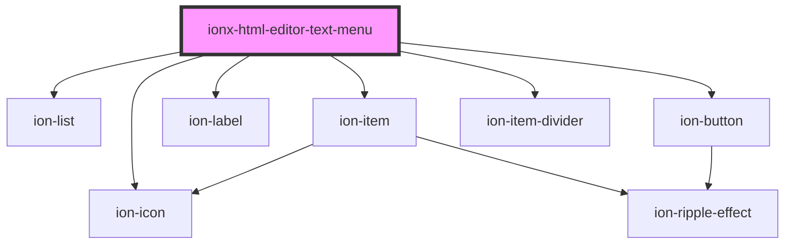

# ionx-html-editor-text-menu

<!-- Auto Generated Below -->

## Properties

| Property              | Attribute | Description | Type                        | Default     |
| --------------------- | --------- | ----------- | --------------------------- | ----------- |
| `editor` _(required)_ | --        |             | `HTMLIonxHtmlEditorElement` | `undefined` |

## Dependencies

### Depends on

- ion-list
- ion-item
- ion-label
- ion-icon
- ion-button
- ion-item-divider

### Graph

----------------------------------------------

*Built with [StencilJS](https://stenciljs.com/)*
