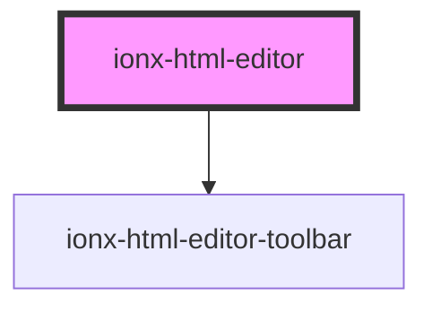

# ionx-html-editor

<!-- Auto Generated Below -->

## Properties

| Property             | Attribute          | Description | Type                                      | Default     |
| -------------------- | ------------------ | ----------- | ----------------------------------------- | ----------- |
| `beforeInitCallback` | --                 |             | `() => Promise<any>`                      | `undefined` |
| `disabled`           | `disabled`         |             | `boolean`                                 | `undefined` |
| `emptyValue`         | `empty-value`      |             | `string`                                  | `undefined` |
| `historyDisabled`    | `history-disabled` |             | `boolean`                                 | `undefined` |
| `keymap`             | --                 |             | `Keymap[] \| { [key: string]: Command; }` | `undefined` |
| `plugins`            | --                 |             | `Plugin<any>[]`                           | `undefined` |
| `readonly`           | `readonly`         |             | `boolean`                                 | `undefined` |
| `schema`             | --                 |             | `Schema<any, any>`                        | `undefined` |
| `toolbarItems`       | --                 |             | `ToolbarItem[]`                           | `undefined` |
| `value`              | `value`            |             | `string`                                  | `undefined` |

## Events

| Event       | Description | Type                              |
| ----------- | ----------- | --------------------------------- |
| `ionChange` |             | `CustomEvent<{ value: string; }>` |

## Methods

### `getScheme() => Promise<Schema>`

#### Returns

Type: `Promise<Schema<any, any>>`

### `getState() => Promise<EditorState>`

#### Returns

Type: `Promise<EditorState>`

### `getView() => Promise<EditorView>`

#### Returns

Type: `Promise<EditorView>`

### `setFocus() => Promise<void>`

#### Returns

Type: `Promise<void>`

## Dependencies

### Depends on

- [ionx-html-editor-toolbar](toolbar)

### Graph

----------------------------------------------

*Built with [StencilJS](https://stenciljs.com/)*
