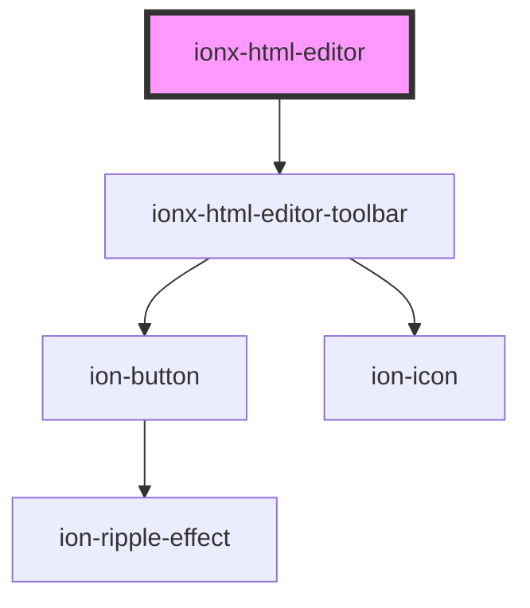

# ionx-html-editor

<!-- Auto Generated Below -->

## Properties

| Property          | Attribute          | Description | Type                           | Default     |
| ----------------- | ------------------ | ----------- | ------------------------------ | ----------- |
| `disabled`        | `disabled`         |             | `boolean`                      | `undefined` |
| `emptyValue`      | `empty-value`      |             | `string`                       | `undefined` |
| `historyDisabled` | `history-disabled` |             | `boolean`                      | `undefined` |
| `keymap`          | --                 |             | `Keymap<any> \| Keymap<any>[]` | `undefined` |
| `plugins`         | --                 |             | `Plugin<any, any>[]`           | `undefined` |
| `readonly`        | `readonly`         |             | `boolean`                      | `undefined` |
| `schema`          | --                 |             | `Schema<any, any>`             | `undefined` |
| `toolbarItems`    | --                 |             | `ToolbarItem[]`                | `undefined` |
| `value`           | `value`            |             | `string`                       | `undefined` |

## Events

| Event       | Description | Type                              |
| ----------- | ----------- | --------------------------------- |
| `ionChange` |             | `CustomEvent<{ value: string; }>` |

## Methods

### `getScheme() => Promise<Schema>`

#### Returns

Type: `Promise<Schema<any, any>>`

### `getState() => Promise<EditorState<Schema>>`

#### Returns

Type: `Promise<EditorState<Schema<any, any>>>`

### `getView() => Promise<EditorView<Schema<any, any>>>`

#### Returns

Type: `Promise<EditorView<Schema<any, any>>>`

### `setFocus() => Promise<void>`

#### Returns

Type: `Promise<void>`

## Dependencies

### Depends on

- [ionx-html-editor-toolbar](toolbar)

### Graph

----------------------------------------------

*Built with [StencilJS](https://stenciljs.com/)*
