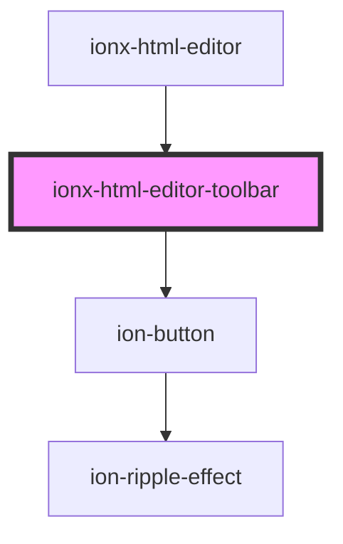

# ionx-html-editor

<!-- Auto Generated Below -->

## Properties

| Property   | Attribute | Description | Type                 | Default     |
| ---------- | --------- | ----------- | -------------------- | ----------- |
| `features` | --        |             | `HtmlEditorFeatures` | `undefined` |

## Dependencies

### Used by

 - [ionx-html-editor](.)

### Depends on

- ion-button

### Graph

----------------------------------------------

*Built with [StencilJS](https://stenciljs.com/)*
