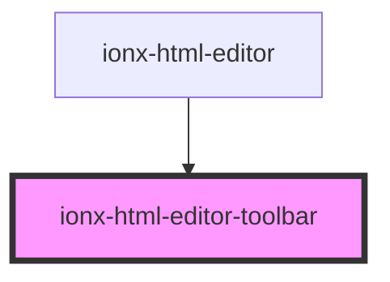

# ionx-html-editor-toolbar

<!-- Auto Generated Below -->

## Properties

| Property          | Attribute          | Description | Type            | Default     |
| ----------------- | ------------------ | ----------- | --------------- | ----------- |
| `historyDisabled` | `history-disabled` |             | `boolean`       | `undefined` |
| `items`           | --                 |             | `ToolbarItem[]` | `undefined` |

## Dependencies

### Used by

 - [ionx-html-editor](..)

### Graph

----------------------------------------------

*Built with [StencilJS](https://stenciljs.com/)*
