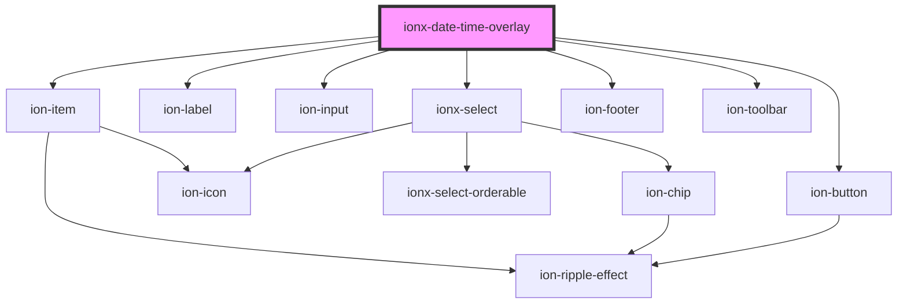

# ionx-date-time-overlay

<!-- Auto Generated Below -->

## Properties

| Property           | Attribute            | Description | Type           | Default     |
| ------------------ | -------------------- | ----------- | -------------- | ----------- |
| `dateOnly`         | `date-only`          |             | `boolean`      | `undefined` |
| `timeZoneDisabled` | `time-zone-disabled` |             | `boolean`      | `undefined` |
| `value`            | --                   |             | `TimeZoneDate` | `undefined` |

## Dependencies

### Depends on

- ion-item
- ion-label
- ion-input
- [ionx-select](../Select)
- ion-footer
- ion-toolbar
- ion-button

### Graph

----------------------------------------------

*Built with [StencilJS](https://stenciljs.com/)*
