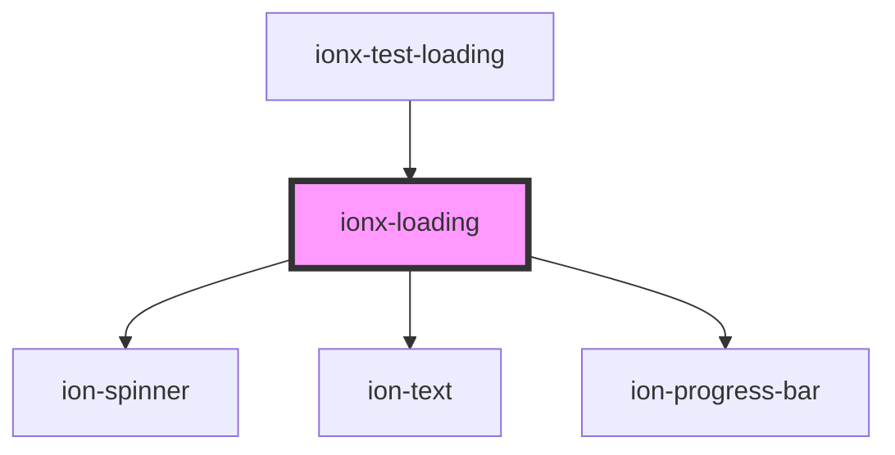

# ionx-loading

<!-- Auto Generated Below -->

## Properties

| Property          | Attribute          | Description                                                                     | Type                               | Default         |
| ----------------- | ------------------ | ------------------------------------------------------------------------------- | ---------------------------------- | --------------- |
| `fill`            | `fill`             | If loading element should fill available space and center content both h and v. | `boolean`                          | `undefined`     |
| `header`          | `header`           |                                                                                 | `string`                           | `undefined`     |
| `message`         | `message`          |                                                                                 | `string`                           | `undefined`     |
| `progressBuffer`  | `progress-buffer`  |                                                                                 | `number`                           | `0`             |
| `progressMessage` | `progress-message` |                                                                                 | `string`                           | `undefined`     |
| `progressPercent` | `progress-percent` |                                                                                 | `number`                           | `undefined`     |
| `progressType`    | `progress-type`    |                                                                                 | `"determinate" \| "indeterminate"` | `"determinate"` |
| `progressValue`   | `progress-value`   |                                                                                 | `number`                           | `0`             |
| `type`            | `type`             | The type of loader.                                                             | `"progress" \| "spinner"`          | `undefined`     |

## Methods

### `dismiss() => Promise<void>`

#### Returns

Type: `Promise<void>`

## Dependencies

### Used by

 - [ionx-test-loading](../../test/components)

### Depends on

- ion-spinner
- ion-text
- ion-progress-bar

### Graph

----------------------------------------------

*Built with [StencilJS](https://stenciljs.com/)*
