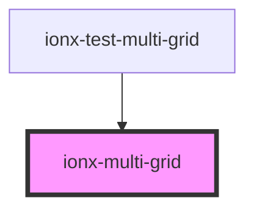

# ionx-multi-grid

<!-- Auto Generated Below -->

## Properties

| Property | Attribute | Description                                                                                           | Type                   | Default     |
| -------- | --------- | ----------------------------------------------------------------------------------------------------- | ---------------------- | ----------- |
| `layout` | `layout`  | If grid should behave as block element, where all its children are layed row by row in single column. | `"block" \| "masonry"` | `undefined` |

## Methods

### `arrange(options?: { force?: boolean; trigger?: "onresize"; }) => Promise<void>`

#### Returns

Type: `Promise<void>`

### `markItemAsDirty(item: HTMLElement) => Promise<void>`

#### Returns

Type: `Promise<void>`

## Dependencies

### Used by

 - [ionx-test-multi-grid](../../test/components)

### Graph

----------------------------------------------

*Built with [StencilJS](https://stenciljs.com/)*
