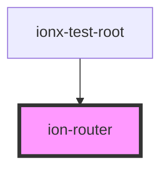

# ion-router

<!-- Auto Generated Below -->

## Properties

| Property  | Attribute  | Description                                                                                                                                                                                                                                                                                                                                                                                                                                                                                                                                                                | Type      | Default |
| --------- | ---------- | -------------------------------------------------------------------------------------------------------------------------------------------------------------------------------------------------------------------------------------------------------------------------------------------------------------------------------------------------------------------------------------------------------------------------------------------------------------------------------------------------------------------------------------------------------------------------- | --------- | ------- |
| `root`    | `root`     | By default `ion-router` will match the routes at the root path ("/"). That can be changed when                                                                                                                                                                                                                                                                                                                                                                                                                                                                             | `string`  | `"/"`   |
| `useHash` | `use-hash` | The router can work in two "modes": - With hash: `/index.html#/path/to/page` - Without hash: `/path/to/page`  Using one or another might depend in the requirements of your app and/or where it"s deployed.  Usually "hash-less" navigation works better for SEO and it"s more user friendly too, but it might requires additional server-side configuration in order to properly work.  On the otherside hash-navigation is much easier to deploy, it even works over the file protocol.  By default, this property is `true`, change to `false` to allow hash-less URLs. | `boolean` | `true`  |

## Events

| Event                | Description                                     | Type                             |
| -------------------- | ----------------------------------------------- | -------------------------------- |
| `ionRouteDidChange`  | Emitted when the route had changed              | `CustomEvent<RouterEventDetail>` |
| `ionRouteWillChange` | Event emitted when the route is about to change | `CustomEvent<RouterEventDetail>` |

## Methods

### `back() => Promise<void>`

Go back to previous page in the window.history.

#### Returns

Type: `Promise<void>`

### `push(url: string, direction?: RouterDirection, animation?: AnimationBuilder) => Promise<boolean>`

Navigate to the specified URL.

#### Returns

Type: `Promise<boolean>`

## Dependencies

### Used by

 - [ionx-test-root](../../test)

### Graph

----------------------------------------------

*Built with [StencilJS](https://stenciljs.com/)*
