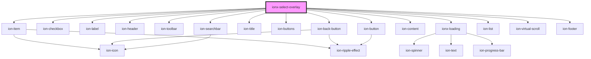

# ionx-select-overlay

<!-- Auto Generated Below -->

## Properties

| Property               | Attribute       | Description | Type                                                                   | Default     |
| ---------------------- | --------------- | ----------- | ---------------------------------------------------------------------- | ----------- |
| `checkValidator`       | --              |             | `(value: any, checked: boolean, otherCheckedValues: any[]) => any[]`   | `undefined` |
| `comparator`           | `comparator`    |             | `"deepEqual" \| "toString" \| ((a: any, b: any) => number \| boolean)` | `undefined` |
| `empty`                | `empty`         |             | `boolean`                                                              | `undefined` |
| `labelFormatter`       | --              |             | `(value: any) => string`                                               | `undefined` |
| `multiple`             | `multiple`      |             | `boolean`                                                              | `undefined` |
| `options`              | --              |             | `SelectOption[]`                                                       | `undefined` |
| `orderable`            | `orderable`     |             | `boolean`                                                              | `undefined` |
| `overlay` _(required)_ | `overlay`       |             | `"modal" \| "popover"`                                                 | `undefined` |
| `overlayTitle`         | `overlay-title` |             | `string`                                                               | `undefined` |
| `searchTest`           | --              |             | `(query: string, value: any, label: string) => boolean`                | `undefined` |
| `values`               | --              |             | `any[]`                                                                | `undefined` |

## Dependencies

### Depends on

- ion-item
- ion-checkbox
- ion-label
- ion-header
- ion-toolbar
- ion-back-button
- ion-title
- ion-buttons
- ion-button
- ion-searchbar
- ion-content
- [ionx-loading](../Loading)
- ion-list
- ion-virtual-scroll
- ion-footer

### Graph

----------------------------------------------

*Built with [StencilJS](https://stenciljs.com/)*
