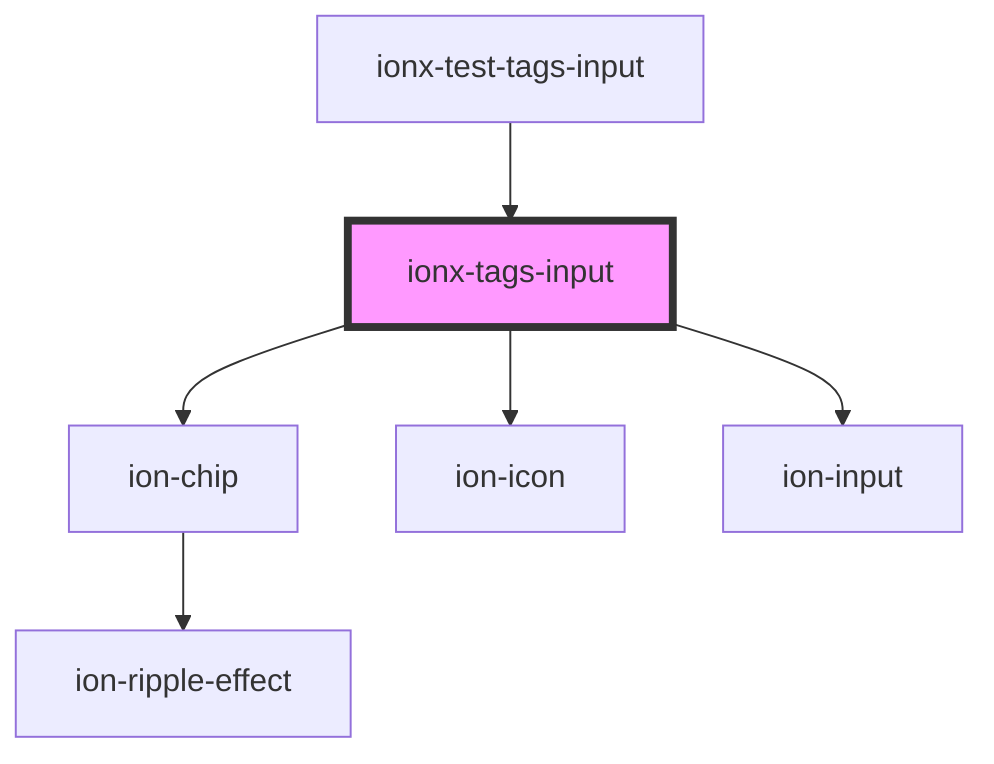

# ionx-tags-input

<!-- Auto Generated Below -->

## Properties

| Property             | Attribute              | Description | Type                                                                                                                                     | Default     |
| -------------------- | ---------------------- | ----------- | ---------------------------------------------------------------------------------------------------------------------------------------- | ----------- |
| `canBackspaceRemove` | `can-backspace-remove` |             | `boolean`                                                                                                                                | `false`     |
| `canEnterAdd`        | `can-enter-add`        |             | `boolean`                                                                                                                                | `true`      |
| `hideRemove`         | `hide-remove`          |             | `boolean`                                                                                                                                | `undefined` |
| `maxTags`            | `max-tags`             |             | `number`                                                                                                                                 | `-1`        |
| `placeholder`        | `placeholder`          |             | `string`                                                                                                                                 | `"+Tag"`    |
| `readonly`           | `readonly`             |             | `boolean`                                                                                                                                | `false`     |
| `required`           | `required`             |             | `boolean`                                                                                                                                | `undefined` |
| `separator`          | `separator`            |             | `string`                                                                                                                                 | `","`       |
| `sortFn`             | --                     |             | `(a: string, b: string) => number`                                                                                                       | `undefined` |
| `sortable`           | `sortable`             |             | `boolean`                                                                                                                                | `undefined` |
| `type`               | `type`                 |             | `"date" \| "datetime-local" \| "email" \| "month" \| "number" \| "password" \| "search" \| "tel" \| "text" \| "time" \| "url" \| "week"` | `"text"`    |
| `unique`             | `unique`               |             | `boolean`                                                                                                                                | `true`      |
| `value`              | --                     |             | `string[]`                                                                                                                               | `[]`        |
| `verifyFn`           | --                     |             | `(tagSrt: string) => boolean`                                                                                                            | `undefined` |

## Events

| Event        | Description | Type                    |
| ------------ | ----------- | ----------------------- |
| `ionxChange` |             | `CustomEvent<string[]>` |

## Dependencies

### Used by

 - [ionx-test-tags-input](../../test/components)

### Depends on

- ion-chip
- ion-icon
- ion-input

### Graph

----------------------------------------------

*Built with [StencilJS](https://stenciljs.com/)*
