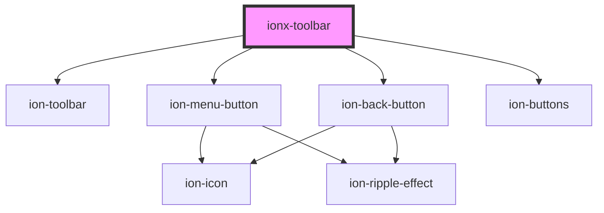

# ionx-toolbar

<!-- Auto Generated Below -->

## Properties

| Property              | Attribute           | Description | Type                          | Default     |
| --------------------- | ------------------- | ----------- | ----------------------------- | ----------- |
| `button` _(required)_ | `button`            |             | `"back" \| "close" \| "menu"` | `undefined` |
| `buttonHandler`       | --                  |             | `() => void`                  | `undefined` |
| `buttonIcon`          | `button-icon`       |             | `string`                      | `undefined` |
| `defaultBackHref`     | `default-back-href` |             | `string`                      | `undefined` |
| `titleWrap`           | `title-wrap`        |             | `"collapse" \| boolean`       | `false`     |

## Dependencies

### Depends on

- ion-toolbar
- ion-menu-button
- ion-back-button
- ion-buttons

### Graph

----------------------------------------------

*Built with [StencilJS](https://stenciljs.com/)*
