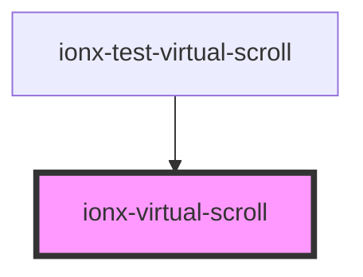

# ionx-virtual-scroll

<!-- Auto Generated Below -->

## Properties

| Property                | Attribute     | Description | Type                       | Default     |
| ----------------------- | ------------- | ----------- | -------------------------- | ----------- |
| `itemHeight`            | `item-height` |             | `number`                   | `30`        |
| `itemWidth`             | `item-width`  |             | `number`                   | `undefined` |
| `items` _(required)_    | --            |             | `any[]`                    | `undefined` |
| `renderer` _(required)_ | --            |             | `(index: number) => VNode` | `undefined` |

## Dependencies

### Used by

 - [ionx-test-virtual-scroll](../../test/components)

### Graph

----------------------------------------------

*Built with [StencilJS](https://stenciljs.com/)*
