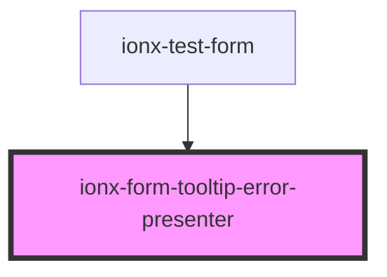

# ionx-form-tooltip-error-presenter

<!-- Auto Generated Below -->

## Properties

| Property   | Attribute  | Description | Type                                   | Default     |
| ---------- | ---------- | ----------- | -------------------------------------- | ----------- |
| `instance` | `instance` |             | `TooltipErrorPresenterImpl \| boolean` | `undefined` |
| `options`  | --         |             | `TooltipErrorPresenterOptions`         | `undefined` |

## Dependencies

### Used by

 - [ionx-test-form](../../../test/components/forms)

### Graph

----------------------------------------------

*Built with [StencilJS](https://stenciljs.com/)*
