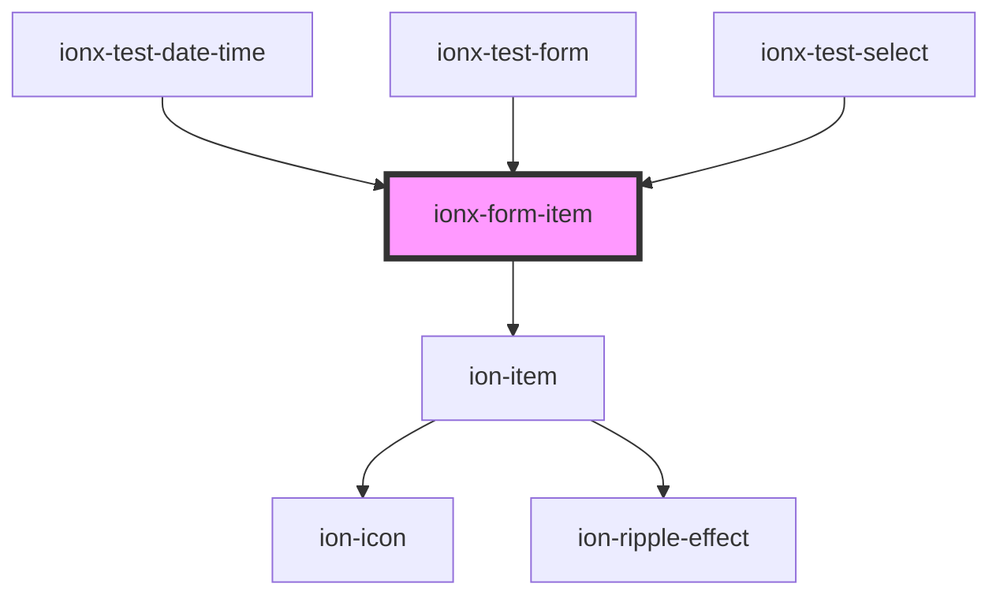

# ionx-form-item

<!-- Auto Generated Below -->

## Properties

| Property  | Attribute | Description                                                                                                                           | Type                                                   | Default     |
| --------- | --------- | ------------------------------------------------------------------------------------------------------------------------------------- | ------------------------------------------------------ | ----------- |
| `control` | --        |                                                                                                                                       | `FormControlState<any>`                                | `undefined` |
| `error`   | `error`   |                                                                                                                                       | `Error \| FormValidationError \| MessageRef \| string` | `undefined` |
| `fill`    | `fill`    | This attributes determines the background and border color of the form item. By default, items have a clear background and no border. | `"clear" \| "outline" \| "solid"`                      | `undefined` |
| `hint`    | `hint`    |                                                                                                                                       | `string`                                               | `undefined` |

## Dependencies

### Used by

 - [ionx-test-date-time](../../test/components)
 - [ionx-test-form](../../test/components/forms)
 - [ionx-test-select](../../test/components)

### Depends on

- ion-item

### Graph

----------------------------------------------

*Built with [StencilJS](https://stenciljs.com/)*
