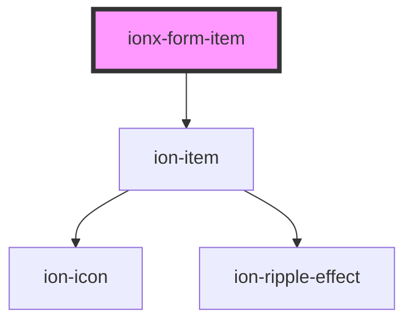

# ionx-form-item

<!-- Auto Generated Below -->

## Properties

| Property | Attribute | Description                                                                                                                           | Type                              | Default     |
| -------- | --------- | ------------------------------------------------------------------------------------------------------------------------------------- | --------------------------------- | ----------- |
| `error`  | `error`   |                                                                                                                                       | `string`                          | `undefined` |
| `fill`   | `fill`    | This attributes determines the background and border color of the form item. By default, items have a clear background and no border. | `"clear" \| "outline" \| "solid"` | `undefined` |
| `hint`   | `hint`    |                                                                                                                                       | `string`                          | `undefined` |

## Dependencies

### Depends on

- ion-item

### Graph

----------------------------------------------

*Built with [StencilJS](https://stenciljs.com/)*
