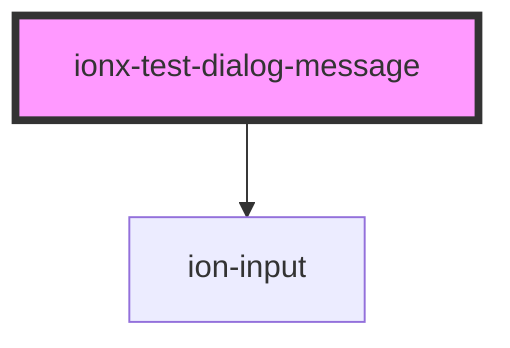

# ionx-test-dialog-message

<!-- Auto Generated Below -->

## Methods

### `dialogValue() => Promise<string>`

#### Returns

Type: `Promise<string>`

## Dependencies

### Depends on

- ion-input

### Graph

----------------------------------------------

*Built with [StencilJS](https://stenciljs.com/)*
