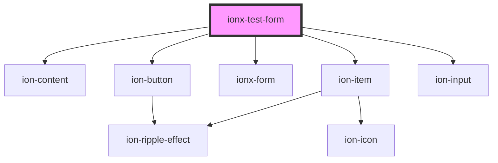

# ionx-test-form

<!-- Auto Generated Below -->

## Dependencies

### Depends on

- ion-content
- ion-button
- [ionx-form](../../../components/form)
- ion-item
- ion-input

### Graph

----------------------------------------------

*Built with [StencilJS](https://stenciljs.com/)*
