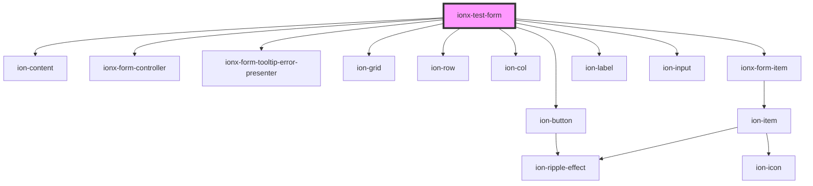

# ionx-test-form

<!-- Auto Generated Below -->

## Dependencies

### Depends on

- ion-content
- ion-button
- [ionx-form-controller](../../../components/forms)
- [ionx-form-tooltip-error-presenter](../../../components/forms/TooltipErrorPresenter)
- ion-grid
- ion-row
- ion-col
- [ionx-form-item](../../../components/forms)
- ion-label
- ion-input

### Graph

----------------------------------------------

*Built with [StencilJS](https://stenciljs.com/)*
