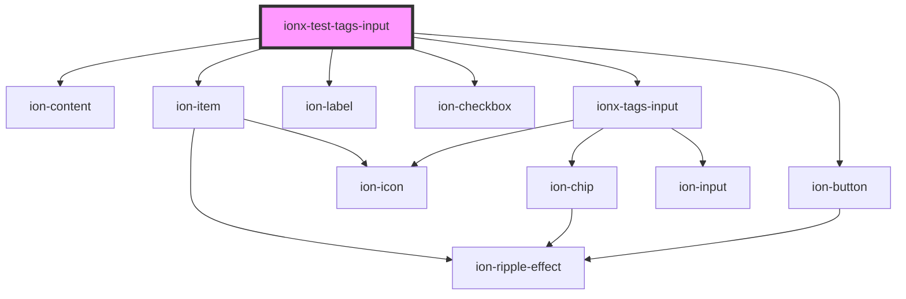

# ionx-test-tags-input

<!-- Auto Generated Below -->

## Dependencies

### Depends on

- ion-content
- ion-item
- ion-label
- ion-checkbox
- [ionx-tags-input](../../components/TagsInput)
- ion-button

### Graph

----------------------------------------------

*Built with [StencilJS](https://stenciljs.com/)*
