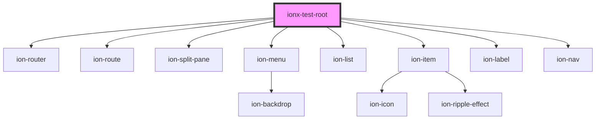

# ionx-test-root

<!-- Auto Generated Below -->

## Dependencies

### Depends on

- [ion-router](../components/Router)
- ion-route
- ion-split-pane
- ion-menu
- ion-list
- ion-item
- ion-label
- ion-nav

### Graph

----------------------------------------------

*Built with [StencilJS](https://stenciljs.com/)*
